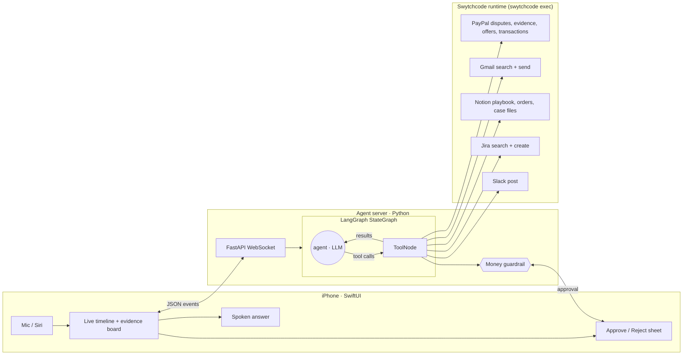

# Ledger: an AI COO in your pocket, with a Chargeback Detective

> **Build with Swytchcode, Gurgaon**, Track 6: AI Business Operator.
> Native iOS (SwiftUI + voice + Siri) · LangGraph agent · 5 integrations via Swytchcode: PayPal, Gmail, Notion, Jira, Slack.

## The problem
Indian exporters and D2C brands sell worldwide through PayPal. When an overseas buyer files a
chargeback ("never received it", "not as described", "unauthorised"), the merchant has only a few days to
respond **with evidence**, and that evidence is scattered: tracking in the order log, the buyer's own
"it arrived, love it!" email in Gmail, QC notes in Notion. Founders rarely have time to dig, so they
**lose disputes they should win** and miss the fraud rings they should block.

## What Ledger does
**Jarvis mode.** *"Hey Siri, brief me with Ledger."* Ledger reads the founder's Notion playbook, pulls PayPal
sales and open disputes plus Jira blockers, then **speaks** a 30-second brief: revenue vs target, money at risk,
top blocker, and one recommended action.

**Detective mode.** *"Investigate today's disputes."* For each PayPal dispute, Ledger:
1. pulls the dispute from **PayPal**
2. looks up the order in **Notion** (tracking, ship-to address, QC notes)
3. searches **Gmail** for the buyer's messages
4. pins each decisive clue to the case board on the phone (evidence cards)
5. decides based on the playbook:

| Case | Evidence Ledger finds | Verdict | Actions |
|---|---|---|---|
| John: "never received" $420 | DHL delivered and signed "J CARTER"; John's own email: *"lamp arrived… looks stunning"* | **Contest** | Submits evidence to PayPal |
| Emma: "not as described" $180 | Notion QC note: warehouse shipped teal instead of cobalt | **Our fault, so settle** | $72 partial-refund offer (**founder approves on phone**) + apology email |
| Alex: "unauthorised" $1,250 | New account, 3 orders in 40 minutes, ship-to a freight forwarder, "ship TODAY" email | **Fraud** | Accept claim (**approval**) + Jira: stop unshipped KC-1062 + Slack #ops alert |

6. logs a case file in **Notion** and posts one summary to **Slack**.

Money never moves without the founder tapping **Approve**. This is enforced in code, not left to the prompt.

## Why it's an agent, not a script
- The LLM chooses tools and their order; each result (a delivery signature, an email) changes the next step and the verdict.
- The rules live in Notion. Change the playbook (e.g. max partial refund 40% → 20%) and the same request produces a different offer.
- Rejections feed back into the loop: if the founder rejects a refund, Ledger logs the case as *pending founder* instead of retrying.

## Architecture


Events streamed to the phone: `thought`, `decision` (tool selection), `tool_call`, `tool_result`, `finding`,
`approval_request`, `approval_resolved`, `final`.

## Repo
```
server/app/agent.py          LangGraph graph + system prompt (Jarvis / Detective modes)
server/app/tools.py          15 tools (PayPal ×6, Gmail ×2, Notion ×3, Jira ×2, Slack, record_finding)
server/app/backends/swytch.py  Swytchcode-backed integrations (canonical ids in TOOL_IDS)
server/app/backends/mock.py    demo world: Kaarigar Co., a Jaipur pottery exporter (seed.py)
server/tests/test_flow.py    end-to-end tests with a scripted LLM (no API key needed)
ios/Ledger/…                 SwiftUI app: voice (Speech), TTS, App Intents, approval sheet
```

## Run it
```bash
# server (Python 3.12)
cd server && python3.12 -m venv .venv && source .venv/bin/activate
pip install -r requirements.txt && cp .env.example .env   # set LLM_MODEL + key
python -m pytest -q
./run.sh    # starts uvicorn on IPv4+IPv6 and prints the URL to paste into the app

# iOS
cd ios && xcodegen generate && open Ledger.xcodeproj       # run on Simulator or iPhone
```
Going live, per service: `swy auth connect <service>`, then set `BACKEND_<SERVICE>=swytch` in `.env`.
Anything not yet connected stays on the demo world, so the demo never breaks.

## Demo script (2.5 min)
1. *"Hey Siri, brief me with Ledger."* The timeline streams and Ledger speaks: "$X this month, 3 disputes put $1,850 at risk…"
2. *"Investigate the disputes."* Evidence cards appear: signature, buyer's email, QC note, freight-forwarder address.
3. The approval sheet appears for the $72 offer and the $1,250 fraud refund. Tap **Approve**.
4. Show the Slack #ops post, the Jira ticket and the Notion case files.
5. Punchline: "Ledger won $420, saved a customer relationship for $72, and stopped a $450 shipment to a fraudster, in 60 seconds."
